# PyFilter
PyFilter is an open-source data assimilation system developped for assimilation-based forecast. To start the system, configure the whole system first (make sure all the scripts are tested in advance). Experimental run and operational forecast are supported in the system. You can type  
```bash
python3 start_run.py
python3 start_forecast.py
```
under home directory with the appropriate environment.

Or you can also start the system to the destinated directory by typing: 
```bash
python3 boot_up.py
```
This method is **prefered** for it keeps the source directories clean and supports for multiple projects running at the same time. 

## Table of contents
- [PyFilter](#pyfilter)
  - [Table of contents](#table-of-contents)
  - [Overview](#overview)
    - [Requirements](#requirements)
    - [Configuration](#configuration)
    - [Job tree](#job-tree)
    - [Output file structure](#output-file-structure)

## Overview 
PyFilter is written in python. Python 3.8 is recommended to drive the system. Other versions of python are not tested yet. 

Figure below is the logical map of the system. 



### Requirements 
See the `requirements.txt`

### Configuration
All the configure files are placed in the `config` directory. They are not included in the source codes since everyone can have a different version of them. Currently, there are few files listed below.

| file name           | description                                              |
| ------------------- | -------------------------------------------------------- |
| `Info.json`         | about the user and host machine                          |
| `Initial.json`      | about initial process before the rolling forecast starts |
| `Prepare.json`      | about process before every start of rolling forecast     |
| `Observation.json`  | information about the observations                       |
| `input.json`        | information about the input                              |
| `Assimilation.json` | about the assimilation algorithm parameters              |
| `Model.json`        | about the model parameters                               |

A detailed description about the config files can be found in `manual` branch. 

Note : 
- Don't add comments (`//`) in json files for only the classic json format is supported ! 
- Don't add `/` in the end of a path. For example, '/home/pyfilter' is fine but '/home/pyfilter/' will cause errors. 

### Job tree 
You can see all the scripts in `Scripts.json`. All the supported parts should be registed in that config file to ensure the system locate the script. The scripts are organized by key names. If you want to add a new scheme, specify the script name and key. The rest of configurations are not included in the config directory for they are different for every user. They are explained in detail in the following sections.

### Output file structure 
```
+-- output_path
|   +-- run_project
|       +-- project_name
|           +-- run
|           +-- analysis
|               +-- 20200101_0000
|               +-- ...
|           +-- forecast
|               +-- 20200101_0000
|               +-- ...
+-- observation_path
|   +-- observation_type
|   +-- ...
+-- input_path
|   +-- input_type
|   +-- ...
```
